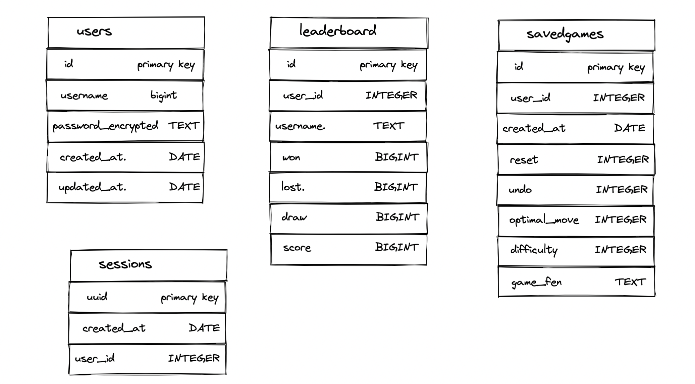

# Chess-Backend ♟️

## Contents

- [Introduction](#introduction)
- [Technologies](#technologies)
- [Launch](#launch)
- [Database Schema](#database-schema)
- [Developers](#developers)

## Introduction

This is the backend server of the Chess app that handles http requests from the client to access the database for information and store new information.

## Technologies

This repository uses [deno](https://deno.land/manual/getting_started/installation), as well as [socket.io](https://socket.io/docs/v4/) to run its files.

We use [PostgreSQL](https://www.postgresql.org/) to host our database.

## Launch

The front end repository which is related to the servers can be found [here](https://github.com/ErikBoonprakong/chess-frontend). It is recommended that you create a folder and clone both the frontend and backend repos into the same folder.

Run the following command into your terminal to initiate the backend server:

```
deno run --allow-net --allow-read --allow-write server.js
```

If you would like your deno script to run continuously, you can make use of the following commands:

```
deno install -qAf --unstable https://raw.githubusercontent.com/nnmrts/denon/patch-4/denon.ts
```

```
deno run --allow-net --allow-read --allow-write server.js
```

In order to run the node server which contains the socket for communication between the server and clients, use the following command:

```
nodemon chat.js
```

The frontend React application requires this backend server to be running to work correctly.

## Database Schema



We have also written tests to ensure production of the schema has been carried out as originally specified.

## Developers

The Developers that worked on this project are:

Project Manager & Engineer: [Yassin Serroukh](https://github.com/yassinserroukh)<br/>
Architect & Engineer: [Erik Boonprakong](https://github.com/ErikBoonprakong)<br/>
Quality Assurance & Engineer: [Megan Watson](https://github.com/megwat)<br/>
